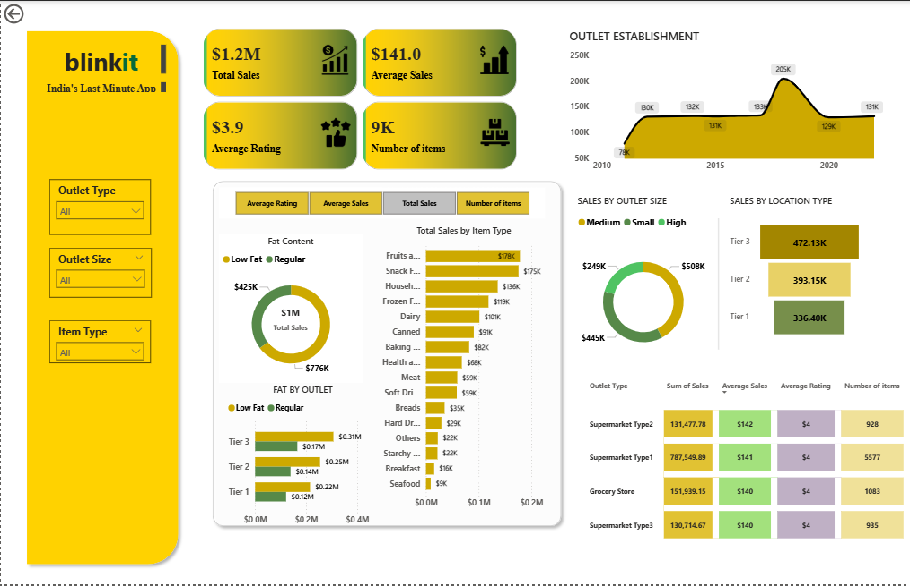

# Blinkit Data Analysis — Power BI Dashboard


> A comprehensive real-time Power BI dashboard for Blinkit (India's Last Minute Grocery App), built to monitor and analyze key operational metrics — sales performance, customer behavior, outlet efficiency, and delivery insights.

---

## 📊 Dashboard Preview

---

## 🎯 Project Objective

To design an end-to-end business intelligence solution that empowers decision-makers at Blinkit to:
- Track **real-time sales performance** across outlet types and locations
- Understand **customer satisfaction trends** via ratings and item feedback
- Identify **top-performing product categories** and optimize inventory
- Analyze **outlet-level efficiency** by size, location tier, and establishment year

---

## 📌 Key Performance Indicators (KPIs)

| KPI | Description |
|-----|-------------|
| 💰 **Total Sales** | Overall revenue generated across all outlets |
| 📦 **Number of Items** | Total distinct items sold |
| ⭐ **Average Rating** | Customer satisfaction score across all transactions |
| 🧾 **Average Sales** | Revenue per transaction/outlet |

---

## 📈 Dashboard Features

### 🔹 Filter Panel
- Outlet Location Type (Tier 1 / Tier 2 / Tier 3)
- Outlet Size (Small / Medium / High)
- Item Type (Fruits, Snacks, Dairy, etc.)

### 🔹 Visualizations Included
- **Donut Chart** — Sales split by Fat Content (Low Fat vs Regular)
- **Bar Chart** — Sales by Item Type
- **Stacked Column Chart** — Fat Content by Outlet Location
- **Line Chart** — Outlet Establishment trend over years
- **Pie/Donut Chart** — Outlet Size distribution
- **Funnel Map** — Sales by Outlet Location Tier
- **Matrix Card** — Outlet Type comparison by Sales, Items, Rating & Visibility

---

## 🗂️ Dataset Overview

| Field | Description |
|-------|-------------|
| `Item Identifier` | Unique product ID |
| `Item Type` | Category (e.g., Fruits, Dairy, Snacks) |
| `Item Fat Content` | Low Fat or Regular |
| `Item Visibility` | Shelf visibility score |
| `Item MRP` | Maximum Retail Price |
| `Outlet Identifier` | Unique outlet ID |
| `Outlet Size` | Small / Medium / High |
| `Outlet Location Type` | Tier 1 / Tier 2 / Tier 3 cities |
| `Outlet Type` | Grocery Store / Supermarket Types |
| `Sales` | Total sales value |
| `Rating` | Customer rating |

> 📁 Source File: `BlinkIT Grocery Data.xlsx`

---

## 🛠️ Tools & Technologies

| Tool | Purpose |
|------|---------|
| **Power BI Desktop** | Dashboard creation & data modeling |
| **Microsoft Excel** | Raw data source |
| **DAX** | Calculated measures & KPIs |
| **Power Query** | Data cleaning & transformation |

---

## 🚀 How to Run

1. **Clone this repository**
   ```bash
   git clone https://github.com/KunalMahajan720/Blinkit-Data-Analysis.git
   ```

2. **Open the dashboard**
   - Launch **Power BI Desktop**
   - Open `blinkit.pbix`

3. **Refresh data source** *(if needed)*
   - Go to `Transform Data` → Update file path to `BlinkIT Grocery Data.xlsx`
   - Click **Refresh**

---

## 💡 Key Business Insights

- **Tier 3 outlets** contribute the highest sales volume despite smaller footprint
- **Low Fat items** account for a significant share of total sales, indicating health-conscious buying
- Outlets established between **2015–2020** show the strongest average sales performance
- **Supermarket Type 1** leads in both total sales and customer ratings

---

## 📬 Connect With Me

[](https://www.linkedin.com/in/kunal-mahajan)
[](https://github.com/KunalMahajan720)

---

> ⭐ *If you found this project useful, please consider giving it a star!*
